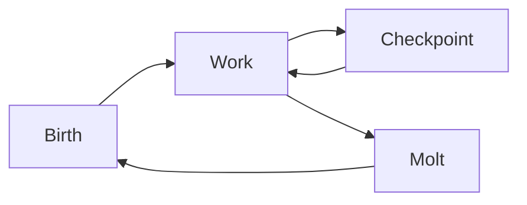

# moltblock.io — Landing Page Language

Canonical copy for the moltblock.io landing page. Drop-in ready.

---

## Headline (1 line)

**Intelligence that molts.**

---

## Paragraph (short pitch)

Moltblock is a framework for building composite intelligences that evolve by molting — not chaining. An Entity is many agents, many models, and verification in one system. It sheds what fails and keeps what's verified, so intelligence scales with structure instead of chaos. A primary use case is [OpenClaw](https://github.com/openclaw/openclaw): Moltblock acts as a structured backend that helps with security — verified code, audit trail, and governance — when the assistant delegates work.

---

## Bullets (4)

- **Structured diversity** — Graph-based agents and multiple LLMs reduce single-point failure and correlated error.
- **Verification first** — No artifact is authoritative until verifiers pass it; memory admits only what's checked.
- **Evolve without restart** — Molt: change agents and models while identity and verified knowledge persist.
- **OpenClaw-ready** — Designed to integrate with OpenClaw; adds verification, signed artifacts, and governance to reduce security risk from generated code and untrusted input.

---

## Diagram (1)

Use a single high-level visual. Recommended: **Entity lifecycle** (Birth → Work → Molt → Checkpoint → repeat) or **Molting not chaining** (one box "Chain" with an arrow labeled "error propagates" vs. one box "Entity" with a loop "molt → checkpoint → work").

**Option A — Lifecycle (Mermaid source for implementation):**

**Option B — Molting not chaining (concept):**  
Side-by-side: "Chain: step1 → step2 → step3 (errors amplify)" vs. "Entity: work ⇄ checkpoint; molt upgrades structure, identity stays."

---

## Usage

- **Headline:** Above the fold, largest type.
- **Paragraph:** Directly under headline; 2–3 lines max in layout.
- **Bullets:** Under paragraph or in a short "Why Moltblock" strip.
- **Diagram:** Center or right column; link to protocol or docs (moltblock.io/docs or repo).

Domain: **moltblock.io**.
