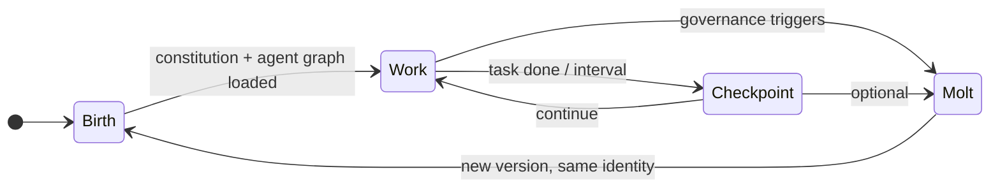
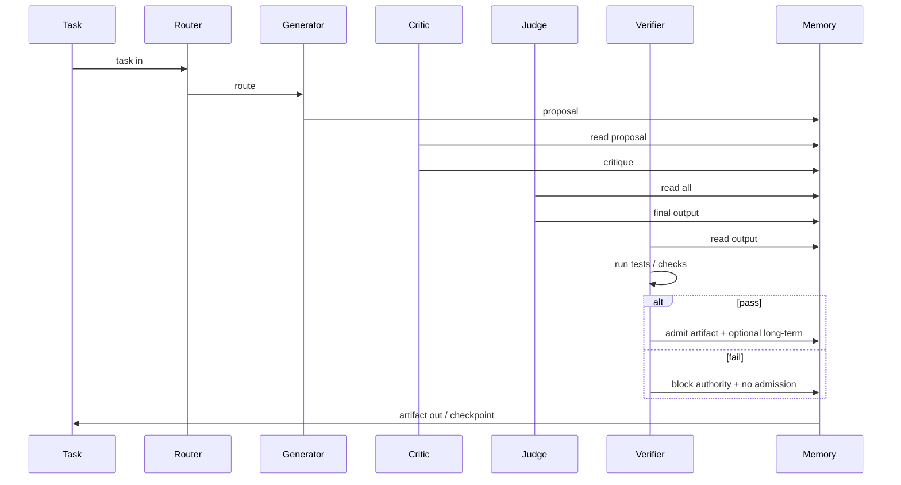

# MVP Entity Spec (v0.2)

This spec defines the minimum runnable Entity: agent roles, model bindings, verification, the minimal runnable loop, and the entity lifecycle. It aligns with [Moltblock Protocol v0.1](moltblock_protocol_v_0.md) and [Composite AI Entity Architecture](composite_ai_entity_architecture.md). The Code Entity MVP is designed to integrate with OpenClaw as a verifiable backend for code and high-stakes tasks.

---

## 1. Entity lifecycle

The Entity lifecycle is a loop: **Birth → Work → Molt → Checkpoint → repeat**. Work may trigger one or more checkpoints; molt is a controlled state transition that preserves identity and verified memory.

- **Birth:** Entity is instantiated with Identity, Constitution, and initial Agent Graph. Memory and governance are initialized.
- **Work:** Tasks enter the minimal runnable loop (see below). Agents run; verification gates artifacts and memory admission.
- **Checkpoint:** Immutable snapshot (entity version, agent graph hash, memory hash, artifact refs) is written. Enables rollback and audit.
- **Molt:** Governance triggers a state transition. Agents/models/strategies may change; Identity, verified memory, and constitution constraints persist. After molt, the Entity continues from a new "Birth" of the next version.

---

## 2. Minimal runnable loop

One complete cycle from task ingestion to artifact/checkpoint:

1. **Task in** — Task (prompt, goal, or structured request) is placed in shared working memory.
2. **Router (optional)** — If the Entity uses a router agent, it selects which subgraph or agents handle the task.
3. **Agent graph execution** — Agents run according to the graph (e.g. Generator → Critic → Judge). Each agent has a model binding; outputs go to working memory.
4. **Verification** — Verifier agent(s) run: tests (for code), consistency checks, hallucination/ethics checks. Pass/fail is recorded.
5. **Gating** — If verification passes and confidence threshold is met: artifact is marked authoritative, and selected information may be admitted to long-term memory. If verification fails: artifact is not authoritative; memory admission is blocked.
6. **Artifact out** — Signed artifact is produced (and optionally stored). Checkpoint may be taken (after this task or on a schedule).

---

## 3. Exact agent roles (MVP graph)

MVP uses a **Generator / Critic / Judge** graph plus a **Verifier**. Optionally a **Router** for task-type routing. All agents have a role, model binding, and input/output contract.

| Role       | Responsibility | Input | Output | Model binding (example) |
|-----------|-----------------|-------|--------|--------------------------|
| **Router** | Classify task; select subgraph or passthrough | Task from working memory | Route decision (e.g. which pipeline) | Small/fast (local or Z.ai) |
| **Generator** | Propose solution, code, or claim | Task + constitution constraints | Draft artifact (text, code, structured claim) | Creative (local LM Studio or Z.ai) |
| **Critic** | Adversarial review; find failures, edge cases | Draft artifact + task | Critique (issues, suggestions) | Different model (e.g. Z.ai) |
| **Judge** | Select or synthesize final output from proposals/critiques | Drafts + critiques | Single final candidate artifact | Third model or same as Critic |
| **Verifier** | Run tests, consistency checks; gate authority and memory | Final candidate artifact | Pass/fail + optional evidence | Reliable (Z.ai or local) |

- **Contract:** Each agent reads from shared working memory and writes to it. Artifacts are structured (e.g. JSON or typed blobs) so Verifier can parse and test.
- **Tool permissions:** Generator and Judge may have tool access (e.g. read-only); Verifier has test-runner and checker tools. Router is typically tool-free.

---

## 4. Which LLMs (model bindings)

MVP supports **hybrid inference**: local (LM Studio / llama.cpp) and Z.ai. Each role has a **model binding**: backend type, base URL, and optional secret ref.

**Recommended MVP bindings (example):**

| Role       | Backend | Base URL / model | Notes |
|-----------|---------|-------------------|--------|
| Router    | local   | `http://localhost:1234/v1` (LM Studio) | Fast, low cost |
| Generator | local   | `http://localhost:1234/v1` (LM Studio) | Creative model |
| Critic    | Z.ai    | `https://api.z.ai/...` + Bearer token | Different model to reduce correlation |
| Judge     | Z.ai    | `https://api.z.ai/...` + Bearer token | Synthesis |
| Verifier  | Z.ai or local | Same as Judge or local | Consistency / tests |

- **Concrete choices:** Use one local model (e.g. Llama 3.x in LM Studio) for Router + Generator, and Z.ai (e.g. GLM-4.x) for Critic, Judge, Verifier. Or swap; the gateway is provider-agnostic.
- **Secrets:** Z.ai Bearer token and Entity signing key live in Secret Manager (or env); local has no key.

---

## 5. How verification runs

- **When:** After the Judge produces the final candidate artifact and writes it to working memory.
- **Who:** The Verifier agent. It may call tools (e.g. vitest for code, consistency checker for claims).
- **Pass/fail criteria:**
  - **Code Entity:** Tests run; all pass → pass. Linter/format optional.
  - **Research Entity:** Claims checked for consistency and citations; confidence threshold → pass/fail.
  - **Governance Entity:** Decision checked against constitution and audit rules → pass/fail.
- **Gating:**
  - **Pass:** Artifact is marked authoritative; Entity signs it. Selected information may be admitted to long-term memory (per memory admission rule).
  - **Fail:** Artifact is not authoritative; no memory admission. Optional: retry with feedback to Generator/Critic/Judge or abort and surface to governance.

Verification is mandatory; no artifact becomes authoritative without passing.

---

## 6. First implementation targets (entity types)

Three concrete Entity types implement this spec with different constitutions, tool sets, and verification rules.

### 6.1 Research Entity

- **Orientation:** Research tasks: claims, evidence, synthesis.
- **Graph:** Generator (draft claims) → Critic (challenge evidence) → Judge (synthesis) → Verifier (consistency + citation checks).
- **Artifacts:** Claims, summaries, structured research notes. Signed and attributable.
- **Verification:** Logical consistency, citation presence, confidence threshold. No code tests.

### 6.2 Code Entity

- **Orientation:** Code: generation, review, tests.
- **Graph:** Generator (code draft) → Critic (review, edge cases) → Judge (final code) → Verifier (run tests, optional linter).
- **Artifacts:** Code, tests, patches. Signed; reproducible.
- **Verification:** Test runner (e.g. vitest); pass = all tests pass. Verification failure blocks authority and memory admission.

### 6.3 Governance Entity

- **Orientation:** Governance: decisions, veto, audit, rate limits.
- **Graph:** Router (classify request) → Generator (propose decision) → Critic (challenge) → Judge (decision) → Verifier (constitution + audit rules).
- **Artifacts:** Decisions, veto logs, rate-limit events. Signed; audit trail.
- **Verification:** Decision conforms to constitution; audit rules satisfied. Human veto can override (governance layer outside the loop).

---

## 7. Summary

- **Lifecycle:** Birth → Work → Molt → Checkpoint → repeat.
- **Loop:** Task in → (Router) → Generator → Critic → Judge → Verifier → gating → artifact out / checkpoint.
- **Roles:** Router (optional), Generator, Critic, Judge, Verifier — each with model binding and contract.
- **LLMs:** Hybrid local (LM Studio / llama.cpp) + Z.ai; configurable per role.
- **Verification:** Runs after Judge; Verifier uses tools and pass/fail; gates authority and memory admission.
- **Implementation targets:** Research Entity, Code Entity, Governance Entity — same spec, different constitutions and verification rules.
