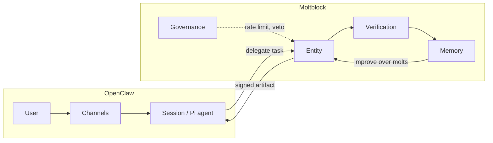

# Moltblock–OpenClaw integration: use and path to singularity

## 1. What is the use of integrating Moltblock with OpenClaw?

**In one sentence:** OpenClaw is the **interface and reach** (channels, users, tools, sessions); Moltblock is the **structured cognitive backend** (entities, verification, memory, governance). Integration lets the assistant delegate high-stakes or code-heavy work to a composite, verified system and reuse verified outcomes. Security is a major driver: OpenClaw's exposure to channels and tools makes verification and governance important; Moltblock provides that layer.

**Concrete benefits:**

| Dimension                 | OpenClaw alone                                     | With Moltblock                                                                                                |
| ------------------------- | -------------------------------------------------- | ------------------------------------------------------------------------------------------------------------- |
| **Code tasks**            | Single-model generation, no mandatory verification | Generator → Critic → Judge → Verifier + pytest; only verified code becomes "authoritative"                    |
| **Assurance**             | Best-effort answers                                | Signed artifacts, checkpoints, audit trail; governance (rate limits, veto, emergency stop)                    |
| **Security**              | Untrusted input and generated code run or sent with best-effort checks | Verified artifacts only as authoritative; signed outputs; checkpoints for audit/rollback; governance (veto, rate limit, emergency stop) |
| **Memory**                | Session/context only                               | Verified long-term memory; failed attempts inform future runs; strategies improve over molts                  |
| **Scale of intelligence** | One agent per session                              | Session can delegate to an Entity (many agents, many models); inter-entity handoff for multi-entity workflows |

So the **use** is: better quality and accountability for code and other verified outputs, persistent learning across runs, and a path from "one assistant" to "assistant + composite entities" without rewriting OpenClaw.

**Reference:** [OpenClaw integration](openclaw_integration.md) — integration options (CLI tool, HTTP API, session–entity handoff) and when to use Moltblock (code tasks, higher assurance, batch/background).

---

## 2. How could it help achieve "singularity"?

The manifesto is explicit: **"Singularity is not a goal. … It is what happens when: intelligence improves itself, faster than it forgets, with fewer constraints each cycle. Moltblock does not chase singularity. It creates the conditions where it *emerges*."** ([Manifesto](moltblock_manifesto.md))

So "achieving singularity" here means **creating the conditions** for that emergence, not building a single superhuman AGI. Those conditions are:

- **Intelligence improves itself** — Entities molt (replace agents, models, strategies) and have a recursive improvement loop (measure → critique → update prompts/strategies). OpenClaw integration means the *same* assistant that people use daily can trigger and consume these improvements (e.g. "run this through Moltblock" and later get better results as Moltblock's strategies evolve).
- **Faster than it forgets** — Verified memory and checkpoints persist; only verified knowledge is admitted. So the system accumulates what works and does not treat every run as stateless. OpenClaw becomes one front-end to this accumulating, improving system.
- **Fewer constraints each cycle** — Governance (rate limits, veto, shutdown) is *outside* the cognitive loop; molts are controlled. Integration lets humans (or OpenClaw sessions) remain in the loop: they decide when to call Moltblock, when to allow a molt, when to pause. So "fewer constraints" can mean better strategies and more capable entities over time, while human oversight remains.

**What OpenClaw adds to those conditions:**

- **Reach:** Many channels (WhatsApp, Telegram, Slack, etc.) and many users/sessions. So the "intelligence" that is improving is not locked in a lab; it is used in real workflows and can be stressed and improved in the wild.
- **Unified interface:** One place (OpenClaw) where users ask for code, refactors, or verified answers; under the hood, some of that work is done by Entities. Singularity-as-emergence is not a single model but a *network*: OpenClaw + Moltblock Entities (and eventually multiple Entities handing off) is a step toward that.

**Constraint from the manifesto:** "Any intelligence we create must be auditable, interruptible, corrigible, remember its past." Integration respects that: OpenClaw stays the control plane the user talks to; Moltblock adds audit trails, checkpoints, governance, and verified memory so that if intelligence accelerates, it does so **with structure**.

---

## 3. Summary diagram

---

**Takeaway:** The **use** of integrating Moltblock with OpenClaw is higher-assurance outputs, verified memory, and composite entities behind the same assistant. It **helps achieve singularity** in the manifesto's sense by giving that assistant a backend where intelligence can improve itself (molting, recursive improvement), retain what works (verified memory), and operate under governance—so the conditions for emergence are satisfied **with structure**, not as an unchecked singleton.
